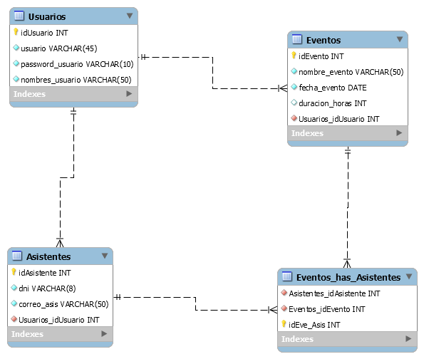

# FDDS-final
Proyecto: App para asitencia de Eventos 
Para este proyecto se estableciòn un modelo relacional de 4 entidades: Usuarios, Asistentes, Eventos y una tabla intermedia Eventos_has_Asistentes.

Como se puede apreciar en la imagen tenemos las siguientes relaciones:
Usuarios se relaciona con Asistentes y Eventos de 1:N, 1 usuario que ingresa en la app puede manejar N Eventos,Asistentes.
Esto nos servirà para saber en la BD què usuario creo què evento o registrò a ciertos Asistentes.
Vemos una tabla intermedia donde encontraremos Quiènes (ASistentes) asistieron a què eventos, siendo esta una relaciòn M:N.
Esto para cuando querramos consultar las personas que asistiràn a cierto Evento.

LA idea de la aplicaciòn es que ciertos usuarios que estèn en la BD puedan crear eventos y en estos registrar a las personas que asistiràn, y asì tener
toda esta informaciòn en la BD y poder hacer cualquier clase de consulta. Se espera tambièn saber cuàntas personas asistieron a cierto evento y tener porcentajes de estos, ver a què 
clase de eventos se asistiò màs, etc.

El framework que se usò fue Android Studio, lenguaje de programaciòn Java.

EL modelo ER de nuestra BD se hizo en MySQL Workbench  

Para el levantamineto de la BD se trabajò 000webhost, un servicio de hosting gratuito donde se implmentò la BD para realizar nuestras diferentes funciones CRUD las cuales 
fueros implementadas en archivos php.

